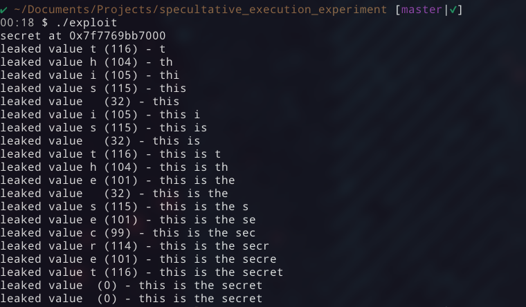

# Speculative Execution

Speculative execution is an optimization technique used by modern CPUs to keep their pipelines busy. Instead of waiting for the outcome of slow operations, such as memory accesses, the processor predicts which instructions will be needed next and starts executing them ahead of time. If the prediction turns out to be wrong, the architectural effects of those instructions are discarded, as if they never ran, however, some microarchitectural traces are left, such as CPU cache lines.

Speculative-execution + side-channel attacks try to exploit this behavior by observing these residual effects. By carefully measuring timing differences, an attacker can infer information about code paths or data that were accessed transiently. This class of vulnerabilities became widely known in 2018 with disclosures such as [Meltdown and Spectre](https://meltdownattack.com/), showing that speculative execution can unintentionally expose sensitive data across isolation boundaries.

## Affected Hardware

Speculative execution issues are not limited to a single CPU model or vendor. In general, most modern out-of-order processors that implement speculative execution may be affected in some form, including CPUs from Intel, AMD, and Arm. The exact impact depends on the specific microarchitecture, the operating system and the compiler.

This experiment was tested on a x86-64 system running Linux kernel 6.17.13 on a 13th Gen Intel Core i7-1365U processor. The program was compiled with GCC 15.2.1. Spectre v1 and Spectre v2 mitigations were enabled and Meltdown was reported as not affected for this CPU.

## The experiment



This is a self-contained experiment to observe how CPUs can execute instructions that never architecturally happened. It also serves as a toy example of how speculative execution can leak data via microarchitectural side effects, using CPU cache lines as a side channel.

Here we deliberately make the CPU execute a slow chain of dependent instructions that eventually triggers a segmentation fault. Just after these memory accesses, a second chain of dependent instructions performs a secret-dependent memory access. Although this second chain is never meant to execute architecturally, it can still run transiently while the processor is waiting for the slow instructions to complete. This allows the CPU to stay busy by speculatively executing ahead.

## High-level overview

In this experiment, these components work together to demonstrate a speculative side-channel leak.

**1. Secret source**

A fake "secret" value is allocated in user space and acts as the input to the speculative access.

**2. Communication buffer**

A shared communication buffer is used to translate secret-dependent memory accesses into observable microarchitectural effects.

**3. Transient gadget**

The core gadget, implemented in speculative_exploit.s, executes transiently while the CPU is still waiting for earlier, slower operations to complete.

**4. Side-channel recovery**

A cache-based side channel is used to recover which part of the communication buffer was accessed during transient execution.

**5. Noise handling**

To reduce measurement noise, the experiment relies on repeated sampling, histogram-based decoding, and a pseudo-random probing order to minimize hardware prefetch effects.

## Speculative gadget

```asm
    # rdi = target address to leak
    # rsi = communication buffer base address
    xor rcx, rcx
    mov rbx, rsi

    # This is the first dependent group of
    # instructions. It's only purpose is to be
    # slow and cause the CPU to increase the
    # chance of speculatively execute the
    # next dependent chain of instructions.
    mov rax, rdi
    .rept 200
        imul rax, rax
    .endr
    mov rax, [rax]            # Intentional fault by dereferencing an invalid address

    # These instructions will never effectively
    # execute, but can be speculatively executed
    # as transient instructions while the CPU is
    # waiting for the slow dependent chain of
    # instructions above to complete.
    mov cl, byte ptr [rdi]
    shl rcx, 12
    add rbx, rcx
    mov rbx, [rbx]
```

During speculative execution, the value loaded from the target address is used as an index into the communication buffer. Because the buffer is covering 256 pages, accessing `comm_buf[byte * 0x1000]` causes exactly one page, corresponding to the secret byte, to be loaded into the CPU cache. Although the faulting execution is later discarded architecturally, this cache state persists.

## Flush + Reload

To recover the encoded value from the communication buffer, this experiment uses a Flush + Reload technique. It relies on the fact that accessing data from the CPU cache is significantly faster than accessing it from main memory.

Before each speculative attempt, all pages of the communication buffer are explicitly flushed from the cache using the `clflush` instruction. This guarantees a known initial state where no page is cached at the start of the process. After the speculative execution window closes and the fault is handled, the program reloads each page of the communication buffer while measuring access latency. The page that was accessed transiently will still reside in the cache and therefore load noticeably faster than the others. By identifying the fastest reload, the experiment determines which cache line was touched during speculative execution, revealing the secret-dependent memory access.

## Measurement pitfalls

Accurate cache-timing measurements depend heavily on the execution environment and CPU microarchitecture. Modern CPUs often use a mix of per-core and shared cache levels. If execution migrates across CPU cores due to scheduling or context switches, cache state may not be preserved as expected, leading to inconsistent or incorrect measurements. To avoid this, the experiment is pinned to run on a single CPU core.

Another source of noise is hardware prefetching. CPUs may speculatively load memory based on observed access patterns (independently of the transient gadget). To mitigate this, the experiment accesses the communication buffer in a mangled order, making memory access patterns harder to predict and reducing unintended prefetching that would otherwise distort the measurements.

## Limitations and caveats

This experiment is intentionally simplified and is meant for demonstration purposes only. Several factors may limit its reliability and generality.

First, the experiment assumes a controlled environment. Cache noise from other processes, interrupts, and context switches can significantly affect timing measurements and require repeated sampling to obtain stable results.

Second, modern CPUs and operating systems include multiple mitigations against speculative execution attacks. Depending on the platform, microcode updates, kernel configurations, and compiler mitigations may reduce the observable effects demonstrated here.

Third, the experiment operates entirely in user space and does not cross privilege boundaries. Real-world attacks will work on more complex scenarios.

Finally, this code is not intended to demonstrate a practical exploit, but rather to provide an intuitive illustration of how speculative execution and cache-based side channels can interact.

## References and further exploration

If you find this topic interesting, I encourage you to explore the [pwn.college Microarchitecture Exploitation Dojo](https://pwn.college/system-security/speculative-execution/). It also offers hands-on challenges that get much closer to real-world vulnerabilities, including Flush+Reload, Spectre and Meltdown style attacks.
